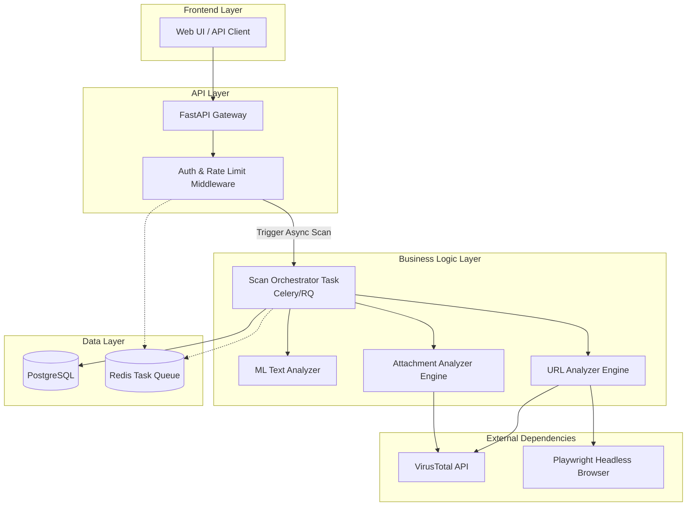
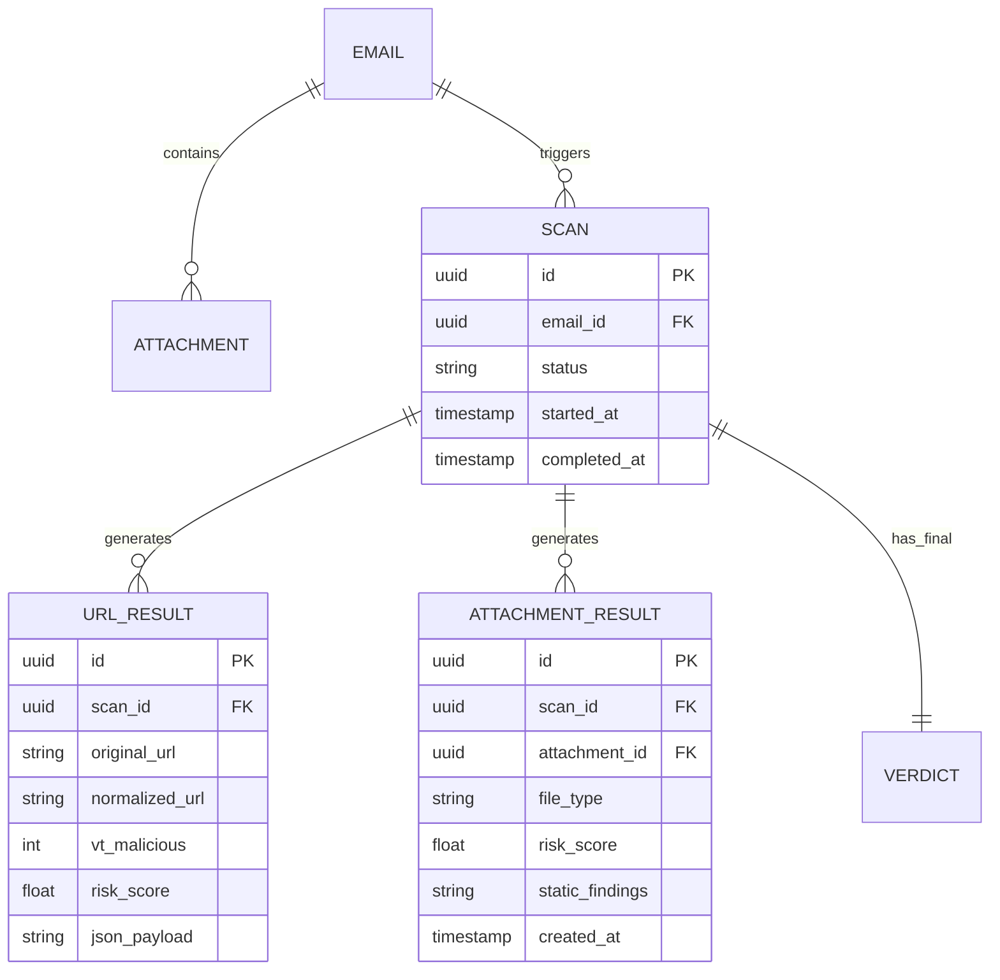

# Implementation Plan: Orchestrated Scanning (URL & Attachment Engines)

## User Review Required
> [!IMPORTANT]
> **Use of Playwright for URL Analysis:** 
> You asked if you should use Playwright. **Yes, but conditionally.** Many modern phishing sites use JavaScript to render payment forms or redirect targets only when loaded in a real browser. Playwright allows dynamic analysis (e.g., catching DOM elements or redirects that static scraping misses).
> *Trade-off*: Playwright is heavy (requires Chromium binaries) and slow. We should run it **asynchronously** (in Celery/RQ/FastAPI Background Tasks) and perhaps only on suspicious URLs that don't trigger immediate VirusTotal alarms.
>
> **Attachment Analysis Libraries:** 
> For static analysis, we will need to introduce specific libraries:
> - `python-magic` (for real MIME detection to catch extension spoofing)
> - `oletools` (for detecting malicious macros in Office documents)
> - `pefile` (for analyzing executable headers)
> - `PyPDF2` or `pikepdf` (for PDF analysis)
>
> Do you approve adding these dependencies (Playwright, python-magic, oletools, pefile) to your pipeline?

## Goal
Implement and integrate the remaining analysis engines (URL Analyzer and Attachment Analyzer) into the existing Phishing Guard V2 pipeline. This completes the core deep-inspection architecture by scoring external links and embedded files alongside the existing ML text engine, storing high-fidelity granular results in an upgraded database schema.

## Requirements
* **URL Engine**:
  * Extract URLs from parsed `body_text` and `body_html`
  * Normalize and deduplicate URLs prior to external requests
  * Query VirusTotal API for reputation lookup
  * Use Playwright (Async headless browser) for dynamic evaluation of JavaScript-rendered phishing pages
  * Calculate and return a `url_score` (0-100)
* **Attachment Engine**:
  * Analyze attachment bytes from the DB storage
  * Perform deep static analysis based on file type (Office Macros via `oletools`, PE metadata via `pefile`, PDF threats)
  * Verify MIME-type versus extension (`python-magic`)
  * Perform SHA256 VirusTotal hash lookup
  * Calculate and return an `attachment_score` (0-100)
* **Database & Orchestration**:
  * Store individual result findings in dedicated `UrlResult` and `AttachmentResult` tables using Alembic migrations.
  * Adjust `ScanService` to aggregate ML, URL, and Attachment scores.
* **Architecture**: Create an Async worker setup to prevent long-running external API calls (VT, Playwright) from timing out the FastAPI HTTP requests.

---

## Technical Considerations

### System Architecture Overview

**Technology Stack Selection Rationale:**
- **URL Engine**: `httpx` for fast async VT API calls. `playwright` for heavy dynamic javascript resolution when a site redirects or uses canvas/DOM obfuscation.
- **Attachment Engine**: Dedicated security-standard python libs (`oletools`, `pefile`, `python-magic`) give the best static analysis without resorting to heavy full-OS sandboxes.
- **Asynchronicity**: Background tasks are mandatory because Playwright rendering + VirusTotal polling exceeds normal synchronous HTTP timeout limits.
- **Containerization**: Playwright requires Chromium, so the `Dockerfile` will need `playwright install --with-deps` alongside your standard python packages.

### Database Schema Design

- **Indexing Strategy**: Index `scan_id` on `URL_RESULT` and `ATTACHMENT_RESULT` for fast aggregation. Index `attachment_id` to prevent redundant scanning.
- **Database Migration Strategy**: Use `alembic` to auto-generate from SQLAlchemy models with safe downgrades (`alembic revision --autogenerate -m "Add url and attachment results"`).

### API Design

- `POST /scans/{email_id}?async=true` -> Returns `202 Accepted` with a `scan_id` / `job_id`. 
- `GET /scans/{scan_id}` -> Returns `200 OK` combining the ML verdict, nested `url_results`, and `attachment_results`.
- **Error Handling**: Graceful degradation. If VirusTotal hits rate-limits (HTTP 429), the engines will gracefully fail back, log a warning, and use local static/heuristic scores or Playwright DOM classification only.
- **Caching**: Implement Redis to cache VT hash/url lookups to significantly reduce API quota burnout.

### Security Performance
- **Validation**: Enforce strictly typed Pydantic models for nested engine results. Let FastAPI catch validation failures.
- **Attachment Safety**: Use in-memory byte streams (`io.BytesIO`) for static analysis. Avoid local disk writing unless absolutely necessary to prevent directory traversal or accidental execution.
- **Isolation**: Playwright Chromium contexts must be strictly ephemeral and discarded after analysis to prevent cached payload persistence.
