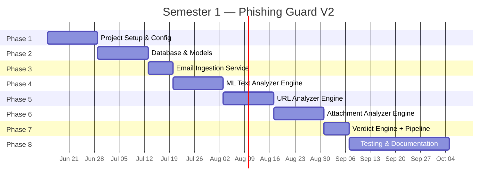

# Phishing Guard V2 — Architecture Analysis & Rebuild Roadmap

## 1. Current Architecture Critique

### What Exists Today

The current project is a **monolithic FastAPI app** (~1,500 LOC across 6 files + an attachment-checker sub-project) with these components mixed together:

| File | LOC | Role | Issues |
|------|-----|------|--------|
| [main.py](file:///c:/Users/Dragon/Desktop/projects/intership/intership-project/main.py) | 373 | API controller + all business logic | God-file: email fetch, scan, attachment analysis, verdict — all in one function |
| [url_scanner.py](file:///c:/Users/Dragon/Desktop/projects/intership/intership-project/url_scanner.py) | 610 | URL extraction + Selenium + VirusTotal + risk scoring | Has **duplicate** [calculate_risk_score](file:///c:/Users/Dragon/Desktop/projects/intership/intership-project/url_scanner.py#565-609) also in [scoring.py](file:///c:/Users/Dragon/Desktop/projects/intership/intership-project/scoring.py); hardcodes `/usr/local/bin/chromedriver` |
| [database.py](file:///c:/Users/Dragon/Desktop/projects/intership/intership-project/database.py) | 218 | 4 SQLAlchemy models | Uses deprecated `declarative_base()`, no migrations (Alembic) |
| [ml_classifier.py](file:///c:/Users/Dragon/Desktop/projects/intership/intership-project/ml_classifier.py) | 98 | PhishingClassifier wrapper | Global singleton pattern, no model versioning |
| [scoring.py](file:///c:/Users/Dragon/Desktop/projects/intership/intership-project/scoring.py) | 171 | Probabilistic risk accumulator | Duplicates code from [url_scanner.py](file:///c:/Users/Dragon/Desktop/projects/intership/intership-project/url_scanner.py) |
| [email_fetcher.py](file:///c:/Users/Dragon/Desktop/projects/intership/intership-project/email_fetcher.py) | 196 | IMAP email fetcher | No error recovery, no pagination |
| [attachment-checker/](file:///c:/Users/Dragon/Desktop/projects/intership/intership-project/attachment-checker) | ~340 | Streamlit UI + analyzers (PE, PDF, Office) | Completely separate app (Streamlit), not integrated with FastAPI |

### Key Problems

1. **Tight Coupling** — [main.py](file:///c:/Users/Dragon/Desktop/projects/intership/intership-project/main.py) directly calls `analyze_file_local()` without importing it (would crash at runtime), references [check_file_virustotal](file:///c:/Users/Dragon/Desktop/projects/intership/intership-project/url_scanner.py#159-224) for both URLs and files through [url_scanner.py](file:///c:/Users/Dragon/Desktop/projects/intership/intership-project/url_scanner.py)
2. **Code Duplication** — [calculate_risk_score](file:///c:/Users/Dragon/Desktop/projects/intership/intership-project/url_scanner.py#565-609) and [calculate_cookie_risk](file:///c:/Users/Dragon/Desktop/projects/intership/intership-project/url_scanner.py#547-563) exist in both [url_scanner.py](file:///c:/Users/Dragon/Desktop/projects/intership/intership-project/url_scanner.py) and [scoring.py](file:///c:/Users/Dragon/Desktop/projects/intership/intership-project/scoring.py)
3. **Two Separate Apps** — The attachment checker runs as a standalone Streamlit app with its own Docker setup, completely disconnected from the main FastAPI scanner
4. **No Testing** — Zero test files exist for the main app
5. **No Database Migrations** — Uses `create_all()` directly; schema changes require wiping the DB
6. **Hardcoded Paths** — `/usr/local/bin/chromedriver`, `/app/static`, `/tmp/attachments`
7. **No Configuration Layer** — API keys, paths, and thresholds scattered across files
8. **No Logging Strategy** — Mix of `print()` statements and unstructured `logging`

---

## 2. Proposed Architecture

```
phishing-guard-v2/
│
├── pyproject.toml                   # Project metadata + deps (replaces requirements.txt)
├── alembic.ini                      # DB migration config
├── .env.example                     # Template for environment variables
├── Dockerfile
├── docker-compose.yml
│
├── alembic/                         # DB migration scripts
│   └── versions/
│
├── app/
│   ├── __init__.py
│   ├── main.py                      # FastAPI app factory (create_app)
│   ├── config.py                    # Pydantic Settings (all config in one place)
│   ├── dependencies.py              # Dependency injection (DB session, services)
│   │
│   ├── models/                      # SQLAlchemy ORM models
│   │   ├── __init__.py
│   │   ├── email.py                 # Email, Attachment
│   │   ├── scan.py                  # Scan, ScannedUrl
│   │   └── verdict.py               # Verdict (new — decoupled from Scan)
│   │
│   ├── schemas/                     # Pydantic request/response schemas
│   │   ├── __init__.py
│   │   ├── email.py
│   │   ├── scan.py
│   │   └── verdict.py
│   │
│   ├── api/                         # Route handlers (thin controllers)
│   │   ├── __init__.py
│   │   ├── router.py                # Main API router aggregator
│   │   ├── scan.py                  # POST /scan, GET /scans
│   │   ├── email.py                 # POST /fetch-emails, GET /emails
│   │   └── health.py                # GET /health
│   │
│   ├── engines/                     # Analysis engines (the core domain logic)
│   │   ├── __init__.py
│   │   ├── text_analyzer.py         # ML phishing classifier
│   │   ├── url_analyzer.py          # URL extraction + VirusTotal
│   │   ├── attachment_analyzer.py   # Static file analysis (PE, PDF, Office, YARA)
│   │   └── verdict_engine.py        # Score aggregation → final verdict
│   │
│   ├── services/                    # Orchestration layer
│   │   ├── __init__.py
│   │   ├── scan_service.py          # Orchestrates: parse → engines → verdict → save
│   │   └── email_service.py         # IMAP fetching + email parsing
│   │
│   ├── integrations/                # External API clients
│   │   ├── __init__.py
│   │   └── virustotal.py            # VT client (URL + file hash lookups)
│   │
│   └── utils/                       # Shared helpers
│       ├── __init__.py
│       ├── hashing.py               # MD5, SHA256 helpers
│       └── strings.py               # String extraction, IOC detection
│
├── data/                            # ML model files
│   └── phishing_model.joblib
│
├── static/                          # Frontend dashboard
│   └── dashboard.html
│
└── tests/
    ├── conftest.py                  # Fixtures (test DB, test client)
    ├── test_text_analyzer.py
    ├── test_url_analyzer.py
    ├── test_attachment_analyzer.py
    ├── test_verdict_engine.py
    ├── test_scan_service.py
    └── test_api.py
```

### Architecture Principles

| Principle | Implementation |
|-----------|---------------|
| **Separation of Concerns** | Routes (api/) → Services → Engines → Integrations |
| **Dependency Injection** | FastAPI's `Depends()` for DB sessions and service instances |
| **Single Responsibility** | Each engine does ONE thing (text, URL, file, verdict) |
| **Configuration Centralization** | `config.py` with Pydantic `BaseSettings` reads from [.env](file:///c:/Users/Dragon/Desktop/projects/intership/intership-project/.env) |
| **Database Migrations** | Alembic for schema evolution without data loss |
| **Testability** | Each engine is independently testable; services use injected deps |

---

## 3. Technology Stack

| Layer | Current | V2 | Rationale |
|-------|---------|-----|-----------|
| API | FastAPI | **FastAPI** | Keep — excellent choice |
| ORM | SQLAlchemy (legacy API) | **SQLAlchemy 2.0** | Modern mapped_column syntax, type hints |
| Migrations | None | **Alembic** | Essential for schema evolution |
| DB | PostgreSQL | **PostgreSQL** | Keep — solid choice |
| ML | Joblib + sklearn | **Joblib + sklearn** | Keep — add model versioning later |
| URL Analysis | Selenium + Chrome | **httpx + BeautifulSoup** (Sem 1) → **Playwright** (Sem 2) | httpx is lighter; Playwright is more reliable than Selenium |
| File Analysis | python-magic + YARA + pefile + olefile | **Same stack** | Keep — these are the right tools |
| External APIs | VirusTotal (requests) | **VirusTotal (httpx async)** | Async-native, connection pooling |
| Config | Scattered [.env](file:///c:/Users/Dragon/Desktop/projects/intership/intership-project/.env) reads | **Pydantic Settings** | Validated, typed, centralized |
| Testing | None | **pytest + pytest-asyncio + httpx** | Full coverage target: 70%+ |
| Deps | requirements.txt | **pyproject.toml** | Modern Python packaging |

---

## 4. Two-Semester Roadmap

### Semester 1 — Core System Rebuild (16 Weeks)



---

#### Phase 1 — Project Setup & Configuration (Weeks 1–2)

**Goal**: Scaffold the V2 project with proper packaging, config, and Docker.

| Task | Details |
|------|---------|
| Init project | `pyproject.toml`, folder structure as shown above |
| Config layer | `app/config.py` with Pydantic `BaseSettings` for: `DATABASE_URL`, `VIRUSTOTAL_API_KEYS`, `EMAIL_HOST/PORT/ADDRESS/PASSWORD`, `ATTACHMENT_DIR`, `MODEL_PATH` |
| Docker setup | [Dockerfile](file:///c:/Users/Dragon/Desktop/projects/intership/intership-project/Dockerfile) + [docker-compose.yml](file:///c:/Users/Dragon/Desktop/projects/intership/intership-project/docker-compose.yml) (app + PostgreSQL) |
| Alembic init | `alembic init alembic`, configure for PostgreSQL |
| `.env.example` | Template with all required variables |
| Git init | [.gitignore](file:///c:/Users/Dragon/Desktop/projects/intership/intership-project/.gitignore), initial commit |

**Milestone**: `docker-compose up` starts the app, `GET /health` returns `200 OK`.

---

#### Phase 2 — Database Models & Migrations (Weeks 3–4)

**Goal**: Define clean data models with Alembic migrations.

**Models** (SQLAlchemy 2.0 `mapped_column` style):

| Model | Key Fields |
|-------|------------|
| [Email](file:///c:/Users/Dragon/Desktop/projects/intership/intership-project/database.py#14-59) | id, message_id, sender, subject, body_text, body_html, has_attachments, fetched_at |
| [Attachment](file:///c:/Users/Dragon/Desktop/projects/intership/intership-project/database.py#61-95) | id, email_id (FK), filename, content_type, size_bytes, sha256_hash, storage_path |
| [Scan](file:///c:/Users/Dragon/Desktop/projects/intership/intership-project/database.py#97-137) | id, email_id (FK), status (pending/running/complete/error), started_at, completed_at |
| `Verdict` | id, scan_id (FK), final_score, classification, ai_score, url_score, attachment_score, breakdown (JSON) |
| `UrlResult` | id, scan_id (FK), url, final_url, vt_malicious, vt_suspicious, risk_score, metadata (JSON) |
| `AttachmentResult` | id, scan_id (FK), attachment_id (FK), verdict, risk_score, static_analysis (JSON), vt_analysis (JSON) |

**Migration**: First Alembic revision creates all tables.

**Milestone**: `alembic upgrade head` creates tables, CRUD operations work in a test script.

---

#### Phase 3 — Email Ingestion Service (Week 5)

**Goal**: Fetch emails via IMAP and parse them cleanly.

| Component | Details |
|-----------|---------|
| `app/services/email_service.py` | Connect to IMAP, fetch N recent emails, parse MIME, extract attachments, save to `uploads/` |
| `app/api/email.py` | `POST /fetch-emails?limit=20`, `GET /emails`, `GET /emails/{id}` |
| Improvements over V1 | Proper error handling, SHA256 hash on save, dedup by message_id |

**Milestone**: Fetch 20 emails from a real Gmail inbox, attachments saved to disk, data in DB.

---

#### Phase 4 — ML Text Analyzer Engine (Weeks 6–7)

**Goal**: Clean reimplementation of phishing text classification.

| Component | Details |
|-----------|---------|
| `app/engines/text_analyzer.py` | Load model from `data/phishing_model.joblib`, preprocess text, return `{is_phishing: bool, confidence: float, label: str}` |
| Model training (optional) | If you want to retrain: use a public phishing email dataset (e.g., Nazario phishing corpus), TF-IDF + LogisticRegression |
| Improvements over V1 | Text preprocessing (strip HTML tags before analysis), model versioning via config |

**Milestone**: `text_analyzer.analyze("Click here to verify your account")` returns a score > 0.5.

---

#### Phase 5 — URL Analyzer Engine (Weeks 8–9)

**Goal**: Extract URLs from email HTML and check them against VirusTotal.

| Component | Details |
|-----------|---------|
| `app/engines/url_analyzer.py` | Extract URLs from HTML (BeautifulSoup), check each via VT |
| `app/integrations/virustotal.py` | Async httpx client with round-robin API key rotation, built-in rate limiting |
| Sem 1 scope | **No Selenium/headless Chrome** — just URL extraction + VT reputation. This keeps it simple and removes the Chrome dependency |
| Risk scoring | Per-URL risk based on VT results (malicious/suspicious/harmless ratios) |

> [!IMPORTANT]
> The current V1 uses Selenium headless Chrome to visit every URL, which is slow and fragile. For Semester 1, we simplify to just VT lookups. Headless browser analysis can return in Semester 2 if needed.

**Milestone**: Extract 5 URLs from a test HTML email, get VT results, compute risk scores.

---

#### Phase 6 — Attachment Analyzer Engine (Weeks 10–11)

**Goal**: Reunify the standalone attachment-checker into the main app.

| Component | Details |
|-----------|---------|
| `app/engines/attachment_analyzer.py` | Orchestrator: calls format-specific analyzers |
| `app/utils/hashing.py` | MD5, SHA256 calculation |
| `app/utils/strings.py` | String extraction, IOC detection (IPs, URLs, domains) |
| Format analyzers | Port existing: [pe.py](file:///c:/Users/Dragon/Desktop/projects/intership/intership-project/attachment-checker/src/analyzers/pe.py), [pdf.py](file:///c:/Users/Dragon/Desktop/projects/intership/intership-project/attachment-checker/src/analyzers/pdf.py), [officedocs.py](file:///c:/Users/Dragon/Desktop/projects/intership/intership-project/attachment-checker/src/analyzers/officedocs.py), [basic.py](file:///c:/Users/Dragon/Desktop/projects/intership/intership-project/attachment-checker/src/analyzers/basic.py) (entropy, YARA) into `app/engines/analyzers/` sub-package |
| VT integration | Hash lookup via `app/integrations/virustotal.py` |

**Milestone**: Analyze a test `.exe`, `.pdf`, and `.docx` file, get verdicts + risk scores.

---

#### Phase 7 — Verdict Engine & Full Pipeline (Week 12)

**Goal**: Wire everything together into a complete scan pipeline.

| Component | Details |
|-----------|---------|
| `app/engines/verdict_engine.py` | Probabilistic risk accumulation: [P(risk) = 1 - (1-p_ai)(1-p_url)(1-p_att)](file:///c:/Users/Dragon/Desktop/projects/intership/intership-project/ml_classifier.py#9-89) (ported from current [scoring.py](file:///c:/Users/Dragon/Desktop/projects/intership/intership-project/scoring.py)) |
| `app/services/scan_service.py` | Orchestrator: [scan_email(email_id)](file:///c:/Users/Dragon/Desktop/projects/intership/intership-project/main.py#223-370) → runs all 3 engines → computes verdict → saves to DB |
| `app/api/scan.py` | `POST /scan/{email_id}`, `GET /scans`, `GET /scans/{id}` |
| Classification | SAFE (< 30) → SUSPICIOUS (30-70) → DANGEROUS (> 70) |

**Milestone**: `POST /scan/1` triggers full pipeline, returns verdict in < 10 seconds.

---

#### Phase 8 — Testing, Dashboard & Documentation (Weeks 13–16)

| Week | Focus |
|------|-------|
| 13 | Unit tests for all engines (pytest), target 70%+ coverage |
| 14 | Integration tests (test client → API → DB), mock VT calls |
| 15 | Simple HTML dashboard (port from V1, clean up) |
| 16 | README, API docs, architecture diagram, deployment guide |

**Milestone**: `pytest --cov` shows 70%+, `docker-compose up` runs everything, README is complete.

---

### Semester 2 — Dynamic Analysis & Polish (16 Weeks)

| Phase | Weeks | Focus |
|-------|-------|-------|
| **S2-Phase 1** | 1–3 | **VM Sandbox Setup** — Windows VM with Sysmon + Event Logger. Build a controller that can submit files to the VM and collect logs |
| **S2-Phase 2** | 4–6 | **Behavior Analyzer** — Parse Sysmon XML logs, detect suspicious patterns (process creation, registry modification, network connections, file system changes) |
| **S2-Phase 3** | 7–8 | **Dynamic + Static Integration** — Combine static score from Sem 1 with dynamic behavior score: `final = static * 0.4 + dynamic * 0.6` (only if file is ambiguous at static level) |
| **S2-Phase 4** | 9–10 | **Headless Browser Analysis** — Add Playwright-based URL visiting (redirect tracking, JS execution, download detection) as an optional deep-scan mode |
| **S2-Phase 5** | 11 | **Security Hardening** — Rate limiting, API key auth, input sanitization, dependency audit |
| **S2-Phase 6** | 12 | **Dashboard Enhancement** — Charts (risk trends over time), stats, export to CSV |
| **S2-Phase 7** | 13–14 | **System Testing** — 30+ unit tests, 10+ integration tests, load testing (50 concurrent emails) |
| **S2-Phase 8** | 15–16 | **Final Documentation & Presentation** — Project report, architecture docs, presentation slides |

---

## 5. Summary: What Changes from V1 to V2

| Aspect | V1 (Current) | V2 (Rebuild) |
|--------|-------------|--------------|
| Structure | 6 flat files + separate Streamlit app | Layered packages: api → services → engines → integrations |
| Config | Scattered `os.environ.get()` | Centralized Pydantic `BaseSettings` |
| DB Migrations | None (`create_all`) | Alembic |
| ORM Style | Legacy `declarative_base` | SQLAlchemy 2.0 `mapped_column` |
| Attachment Checker | Separate Streamlit app | Integrated `attachment_analyzer` engine |
| URL Analysis | Selenium Chrome (fragile) | httpx + VT only (Semester 1), Playwright (Semester 2) |
| Risk Scoring | Duplicated across 2 files | Single `verdict_engine.py` |
| Testing | Zero tests | pytest, 70%+ coverage target |
| Dependencies | [requirements.txt](file:///c:/Users/Dragon/Desktop/projects/intership/intership-project/requirements.txt) | `pyproject.toml` |
| Packaging | Implicit | Modern Python packaging |

---

## Verification Plan

> [!NOTE]
> Since this is a from-scratch rebuild, verification is tied to each phase's milestone (described above). There are no existing tests to verify against.

### Automated Tests (to be written in Phase 8)
```bash
# Run all tests
pytest tests/ -v --cov=app --cov-report=term-missing

# Run specific engine tests
pytest tests/test_text_analyzer.py -v
pytest tests/test_url_analyzer.py -v
pytest tests/test_attachment_analyzer.py -v
pytest tests/test_verdict_engine.py -v

# Run API integration tests
pytest tests/test_api.py -v
```

### Manual Verification (per phase)
1. **Phase 1**: Run `docker-compose up`, hit `http://localhost:8000/health` → expect `{"status": "ok"}`
2. **Phase 2**: Run `alembic upgrade head`, verify tables exist in PostgreSQL
3. **Phase 3**: Configure real Gmail creds, hit `POST /fetch-emails`, verify emails in DB
4. **Phase 7**: Submit a known phishing email HTML, verify verdict matches expectations

### User Testing (suggested)
- After Phase 7, test the full pipeline manually by forwarding a few real emails (both legitimate and suspicious) and reviewing the verdicts
